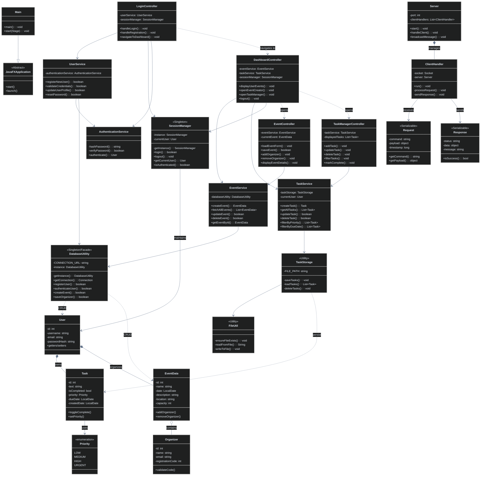
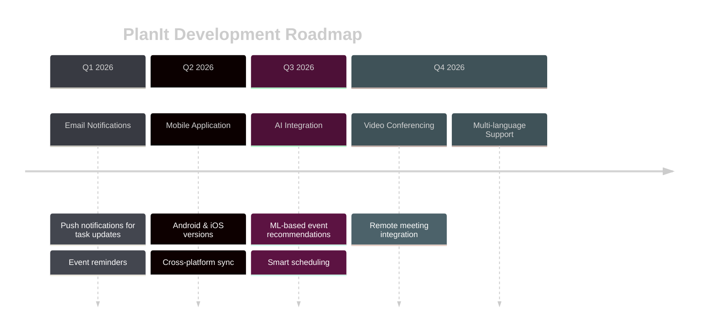

<div align="center">

# PlanIt
### *Plan it.  Execute it. Perfect it.*

[](https://www.java.com/)
[](https://openjfx.io/)
[](https://www.mysql.com/)
[](LICENSE)

<p align="center">
  <strong>A comprehensive JavaFX-based Event Management System</strong><br>
  <em>Developed by Team Abstrax for CSE 2104 - Object Oriented Design and Programming Lab</em>
</p>

**Team Members:** Kazi Maheru Tafannum • Rubaiya Sultana • Shadman Zaman Sajid • Md. Irfan Iqbal

---

</div>

## 📖 Introduction

Traditional event management often suffers from **scattered communication** and **overlapping venue registrations**. **PlanIt** addresses these challenges by providing a centralized platform for event coordination, task management, and stakeholder communication.

### 🎯 Key Objectives

| Objective | Description |
|-----------|-------------|
| 🔄 **Streamline Workflows** | Simplify event planning with intuitive dashboards |
| 👥 **Role-Based Delegation** | Enable efficient task assignment and tracking |
| 🏢 **Venue Management** | Prevent scheduling conflicts with centralized booking |
| 💬 **Real-Time Collaboration** | Foster team communication through discussion forums |

---

## 🚀 Key Features

<table>
<tr>
<td width="50%">

### 👤 User Management
- **Role-Based Access Control**
  - Main Organizers
  - Sub Organizers  
  - Viewers
- **Secure Authentication**
  - "Remember Me" functionality
  - Session persistence

</td>
<td width="50%">

### 📅 Event Coordination
- **Context-Aware Dashboards**
  - Global dashboard view
  - Specific Event Portals
- **Advanced Task Management**
  - Priority levels (High/Medium/Low)
  - Categorization & completion tracking

</td>
</tr>
<tr>
<td width="50%">

### 🏢 Venue Booking
- Interactive booking system
- Database integration
- Overlap prevention
- Real-time availability check

</td>
<td width="50%">

### 💬 Collaboration Tools
- **Discussion Forum**
  - Thread-based discussions
  - 50+ concurrent clients support
  - Multi-threaded server
- **Progress Reports**
  - Create & save detailed reports
  - Split-pane interface

</td>
</tr>
</table>

---

## 🏗 System Architecture (UML)

This diagram provides a detailed look at the classes, relationships, and architectural patterns that make up the PlanIt application.


---

## 💻 Tech Stack

<div align="center">

| Category | Technologies |
|:--------:|:-------------|
| **Language** | Java 8+ |
| **Frontend** | JavaFX, FXML, CSS, Scene Builder |
| **Backend** | Java Socket Programming, Multi-threading |
| **Database** | MySQL (Hosted on Clever-cloud), JDBC |
| **Tools** | IntelliJ IDEA, Git |

</div>

### Technical Highlights

- 🌐 **Networking**: Socket-based client-server architecture using TCP/IP and object serialization.
- 💾 **Persistence**: Hybrid storage using a remote MySQL database and local serialized `.dat` files.
- 🎨 **UI/UX**: Modern dark theme with responsive layouts and animated loading states.
- 🔐 **Security**: Password hashing with BCrypt for secure credential storage.

---

## 📥 Installation & Setup

### Prerequisites

- ☕ **JDK 8** or higher
- 🌐 Active internet connection (for remote database access)
- 💻 IntelliJ IDEA or other Java-compatible IDE

### Quick Start

```bash
# 1. Clone the repository
git clone https://github.com/Ir-Rafi/PlanIt.git

# 2. Navigate to the project directory
cd PlanIt

# 3. Open the project in your IDE and build it

# 4. Run the Main class to start the application
```

### Configuration

The application is pre-configured to use a remote MySQL database hosted on Clever-cloud, so no additional database setup is required for standard use.

### Running the Application

1.  **Import** the project into your IDE (e.g., IntelliJ IDEA).
2.  **Ensure** a compatible JDK (8+) is configured for the project.
3.  **Add** the JavaFX libraries to your project's classpath if your IDE requires it.
4.  **Locate** and run the `Main.java` class to launch the client application.
5.  **Start** the Server module first if you intend to test network features locally.

---

## 📁 Project Structure

```
PlanIt/
├── 📂 src/
│   ├── 📄 Main.java                    # Application entry point
│   ├── 📄 Dashboard.java               # Main dashboard controller
│   ├── 📄 AdvancedTodoListApp.java     # Task management module
│   ├── 📄 EventController.java         # Event handling logic
│   ├── 📄 DatabaseUtility.java         # Database operations
│   ├── 📄 Session.java                 # Session management
│   ├── 📂 fxml/                        # FXML view files
│   └── 📂 css/                         # Stylesheets
├── 📂 Chat/                            # Discussion forum module
├── 📂 img/                             # Images and assets
├── 📂 lib/                             # External libraries
├── 📂 reports/                         # Generated reports
└── 📄 README.md
```

---

## 👥 Team Abstrax

<div align="center">

### 🎓 30th Batch, Department of Computer Science & Engineering
### 🏛️ University of Dhaka

---

**Kazi Maheru Tafannum** • **Rubaiya Sultana** • **Shadman Zaman Sajid** • **Md. Irfan Iqbal**

---

| Roll | Name | Role | Responsibilities |
|:----:|:-----|:----:|:-----------------|
| 03 | **Kazi Maheru Tafannum** | 🔧 Backend Dev | Backend Design, DBMS |
| 05 | **Rubaiya Sultana** | 🎨 UI Designer | UI Design, Conceptualist |
| 14 | **Shadman Zaman Sajid** | 🧪 Tester | Testing, System Programming |
| 35 | **Md.  Irfan Iqbal** | 🏗️ Lead Dev | Backend Architecture, UI Design, Integration |

</div>

---

## 🔮 Future Roadmap



### Planned Features

- [ ] 📱 **Mobile Application** - Android/iOS native apps
- [ ] 📧 **Email Notifications** - Task updates and reminders
- [ ] 🤖 **Machine Learning** - Smart event recommendations
- [ ] 📹 **Video Conferencing** - Remote meeting integration
- [ ] 🌍 **Multi-language Support** - Internationalization

---

## 🔗 Links & Resources

<div align="center">

[](https://github.com/Ir-Rafi/PlanIt)
[](https://www.youtube.com/watch?v=your-demo-link)

</div>

---

## 📄 License

This project was created for academic purposes as part of the CSE 2104 course at the University of Dhaka. It is licensed under the MIT License.

---

<div align="center">

**⭐ Star this repository if you found it helpful!**

Made with ❤️ by **Team Abstrax**

*Submitted on January 03, 2026*

</div>
